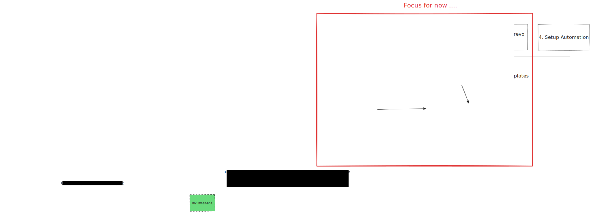
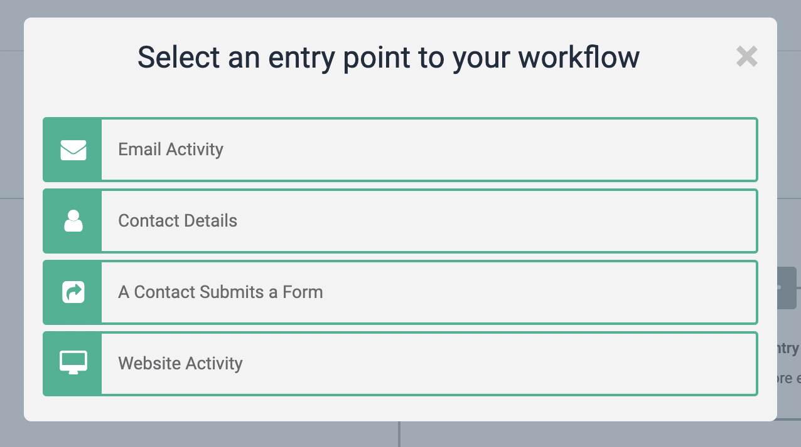
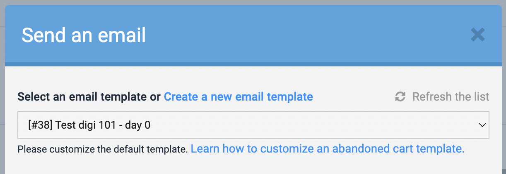
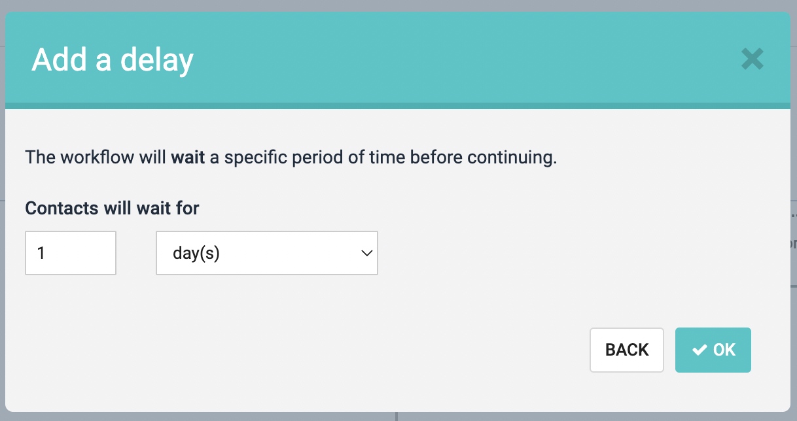

# Brevo Utilities: Markdown => Html => (Brevo) Email template

Automated workflow to google doc into a Brevo email or a series of emails (e.g. to make an email course).

Specifically, converts markdown to html and uploads that as a template to Brevo (formely Sendinblue) via API.

## Design



Excalidraw source: https://link.excalidraw.com/l/9u8crB2ZmUo/3aW9SZ0aW3C

## Usage

### Prerequisite

Before running the script we need a Brevo api key and a markdown file with required frontmatter data (see details below).

Create a `.env` file in createTemplate's root and add the variable as shown below..

```env
BREVO_API_KEY=your_api_key
```

### Running the script

Make sure you have node installed. `node -v`

- cd into the directory `cd scripts/createTemplate`
- `npm install`
- run `node index.js`
- provide the path to the template/markdoen file eg. `template.md`

### Markdown format for creating/updating a template

> **!important**
> Frontmatter fields `senderEmail` and `replyTo` should be valid emails from Brevo.
> If frontmatter isn't provided, default values will be used.

#### Creating a template

Add frontmatter with following fields at the top of the markdown file.

```md
---
title: "Template name"
subject: "Subject of email template"
senderName: "Sender's name"
senderEmail: "Sender's email"
replyTo: "reply email"
---

content here
```

#### Updating a template

If the template already exists and you want to update it, then add an `id` field in the frontmatter with the value matching the template's id in Brevo.

```md
---
id: 33
---

content here
```

The template id can be found in the table list as `#(id)` in Brevo -> Campaigns -> Templates.

#### Adding headers and footers

TODO: document from https://github.com/life-itself/brevo-utils/issues/2

### Creating an email course in Brevo

After creating all the templates using the above, follow the steps below to create an automation workflow ..

1. Create a new automation in Brevo -> Automations
2. Add an entry point (eg. a contact submits a form) and choose the form in the dropdown  

   
   
3. Add a new step and select `Send an email` and choose the first email template to send when a form submits (ie. immediately)  

   
   
4. Add another step, select the condition `Add a delay` and specify the no. of day(s) to wait before sending the next course email  

   
   
5. Add a next step that sends the email and choose the relevant template (same as step 3)
6. Repeat steps 4 and 5 to add more
7. Finally, activate the automation
